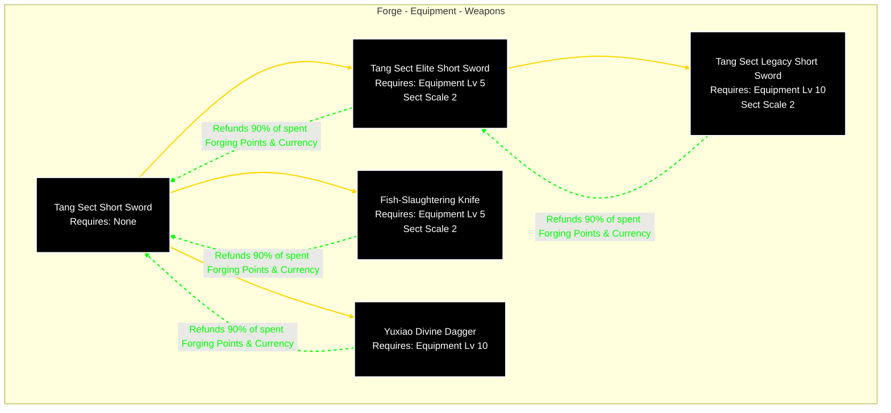
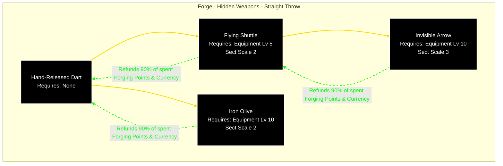
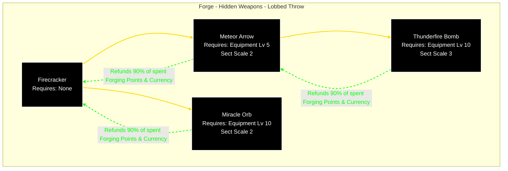
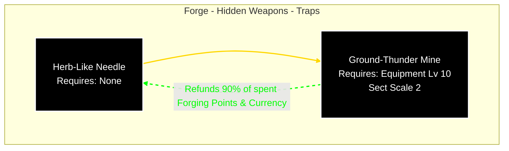
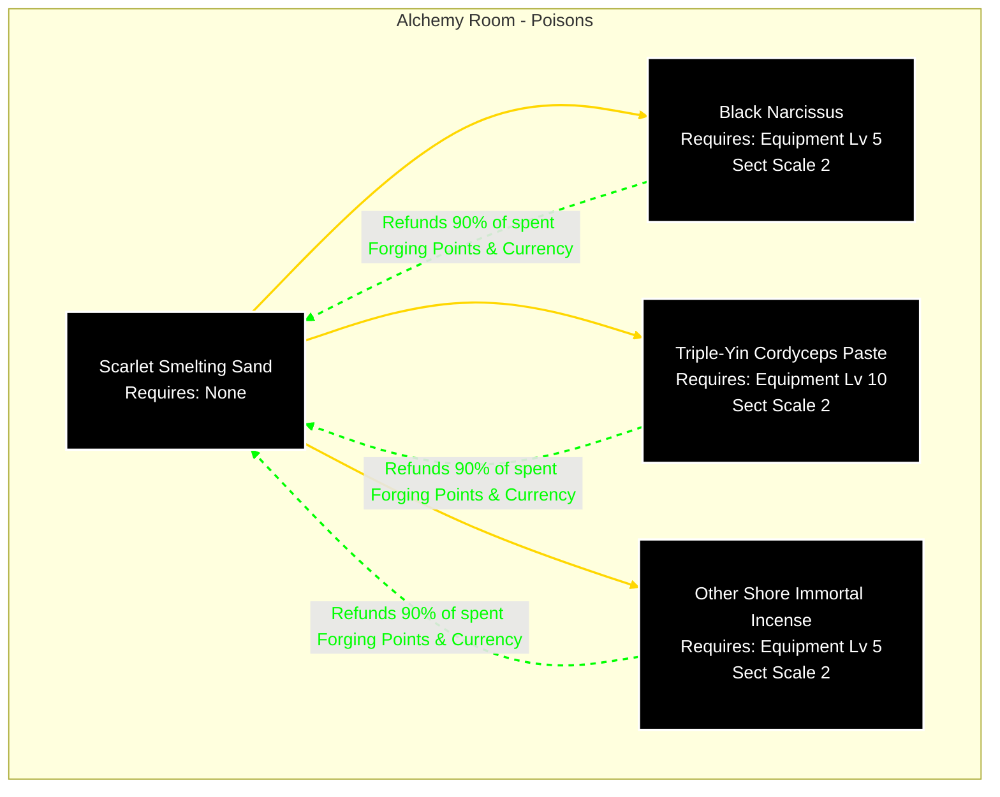
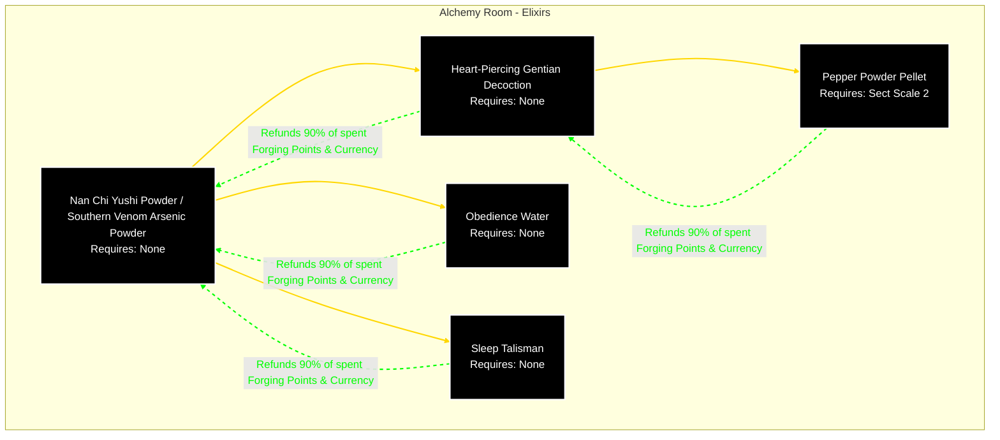

## {{ $frontmatter.title }}

### Forge - Equipment - Weapons

---

### Forge - Equipment - Armor

---

### Forge - Hidden Weapons - Straight Throw

---

### Forge - Hidden Weapons - Lobbed Throw

---

### Forge - Hidden Weapons - Traps

### Alchemy Room - Poisons

### Alchemy Room - Elixirs
