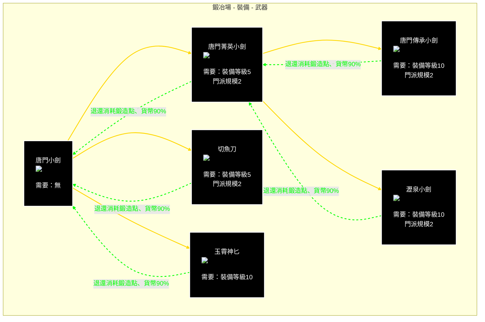
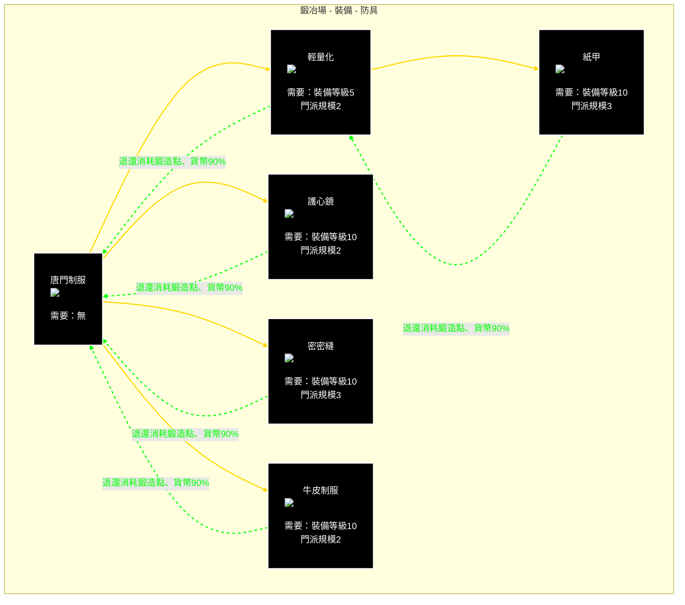
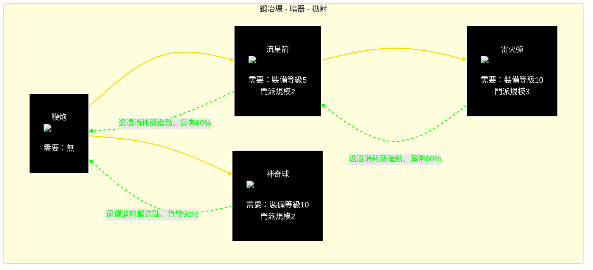
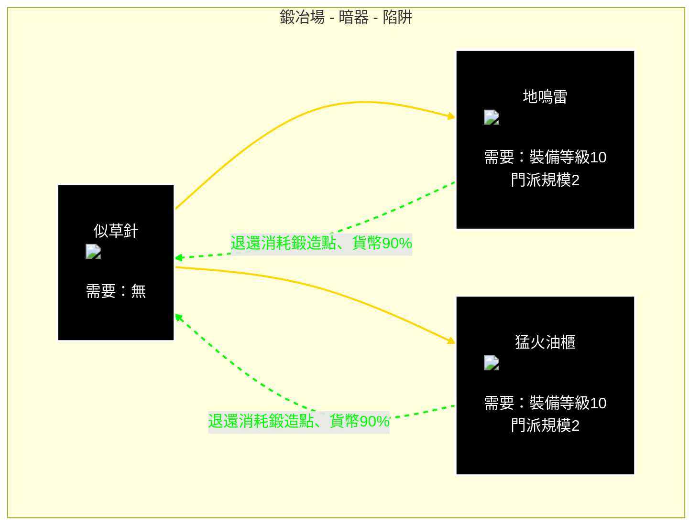
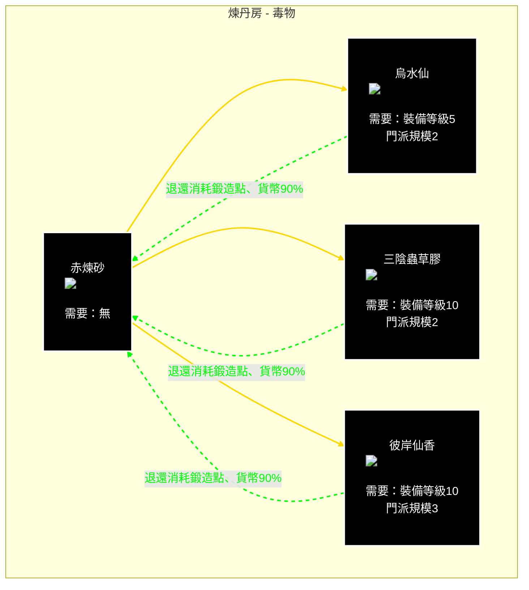
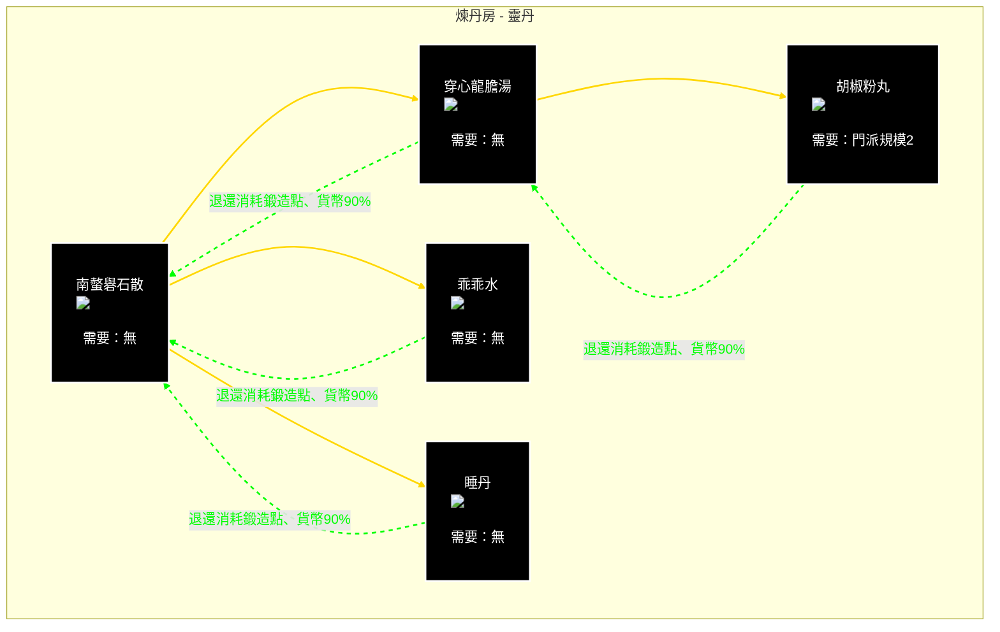

## {{ $frontmatter.title }}

### 鍛冶場 - 裝備 - 武器

```mermaid
%%{init: {
  'flowchart': {
    'nodeSpacing': 70,
    'rankSpacing': 80,
    'theme': 'dark'
  }
} }%%
graph TB
  subgraph 鍛冶場 - 裝備 - 武器
    A[唐門小劍<img src="/LoM-wiki/images/items/swords/icon_sword_01.webp"><br>需要：無]
    B[唐門菁英小劍<img src="/LoM-wiki/images/items/swords/icon_sword_10.webp"><br>需要：裝備等級5<br>門派規模2]
    C[唐門傳承小劍<img src="/LoM-wiki/images/items/swords/icon_sword_20.webp"><br>需要：裝備等級10<br>門派規模2]
    D[切魚刀<img src="/LoM-wiki/images/items/swords/icon_sword_11.webp"><br>需要：裝備等級5<br>門派規模2]
    E[玉霄神匕<img src="/LoM-wiki/images/items/swords/icon_sword_21.webp"><br>需要：裝備等級10]
    F[瀝泉小劍<img src="/LoM-wiki/images/items/swords/icon_sword_22.webp"><br>需要：裝備等級10<br>門派規模2]
  end

  %% 升級箭頭（黃色）+ 文字
  A --> B
  B --> C
  A --> D
  A --> E
  B --> F

  %% 退還箭頭（綠色）+ 文字
  B -.->|<font color='#00FF00'>退還消耗鍛造點、貨幣90%</font>| A
  C -.->|<font color='#00FF00'>退還消耗鍛造點、貨幣90%</font>| B
  D -.->|<font color='#00FF00'>退還消耗鍛造點、貨幣90%</font>| A
  E -.->|<font color='#00FF00'>退還消耗鍛造點、貨幣90%</font>| A
  F -.->|<font color='#00FF00'>退還消耗鍛造點、貨幣90%</font>| B
  
  %% 自訂箭頭樣式與文字顏色
  linkStyle 0 stroke:#FFD700,stroke-width:2px
  linkStyle 1 stroke:#FFD700,stroke-width:2px
  linkStyle 2 stroke:#FFD700,stroke-width:2px
  linkStyle 3 stroke:#FFD700,stroke-width:2px
  linkStyle 4 stroke:#FFD700,stroke-width:2px
  linkStyle 5 stroke:#00FF00,stroke-width:2px,stroke-dasharray:5,5
  linkStyle 6 stroke:#00FF00,stroke-width:2px,stroke-dasharray:5,5
  linkStyle 7 stroke:#00FF00,stroke-width:2px,stroke-dasharray:5,5
  linkStyle 8 stroke:#00FF00,stroke-width:2px,stroke-dasharray:5,5
  linkStyle 9 stroke:#00FF00,stroke-width:2px,stroke-dasharray:5,5

  %% 設定節點樣式
  classDef default padding:15px,margin:10px,fill:#000,color:#FFF
  style A stroke:#FFF,stroke-width:2px,padding:15px,margin:10px,fill:#000,color:#FFF
  style B stroke:#FFF,stroke-width:2px,padding:15px,margin:10px,fill:#000,color:#FFF
  style C stroke:#FFF,stroke-width:2px,padding:15px,margin:10px,fill:#000,color:#FFF
  style D stroke:#FFF,stroke-width:2px,padding:15px,margin:10px,fill:#000,color:#FFF
  style E stroke:#FFF,stroke-width:2px,padding:15px,margin:10px,fill:#000,color:#FFF
  style F stroke:#FFF,stroke-width:2px,padding:15px,margin:10px,fill:#000,color:#FFF


```

---

### 鍛冶場 - 裝備 - 防具

```mermaid
%%{init: {
  'flowchart': {
    'nodeSpacing': 70,
    'rankSpacing': 80,
    'theme': 'dark'
  }
} }%%
graph TB
  subgraph 鍛冶場 - 裝備 - 防具
    A[唐門制服<img src="/LoM-wiki/images/items/equips/icon_equip_01.webp"><br>需要：無]
    B[輕量化<img src="/LoM-wiki/images/items/equips/icon_equip_11.webp"><br>需要：裝備等級5<br>門派規模2]
    C[護心鏡<img src="/LoM-wiki/images/items/equips/icon_equip_10.webp"><br>需要：裝備等級10<br>門派規模2]
    D[密密縫<img src="/LoM-wiki/images/items/equips/icon_equip_20.webp"><br>需要：裝備等級10<br>門派規模3]
    E[牛皮制服<img src="/LoM-wiki/images/items/equips/icon_equip_22.webp"><br>需要：裝備等級10<br>門派規模2]
    F[紙甲<img src="/LoM-wiki/images/items/equips/icon_equip_21.webp"><br>需要：裝備等級10<br>門派規模3]
  end

  %% 升級箭頭（黃色）+ 文字
  A --> B
  A --> C
  A --> D
  A --> E
  B --> F

  %% 退還箭頭（綠色）+ 文字
  B -.->|<font color='#00FF00'>退還消耗鍛造點、貨幣90%</font>| A
  C -.->|<font color='#00FF00'>退還消耗鍛造點、貨幣90%</font>| A
  D -.->|<font color='#00FF00'>退還消耗鍛造點、貨幣90%</font>| A
  E -.->|<font color='#00FF00'>退還消耗鍛造點、貨幣90%</font>| A
  F -.->|<font color='#00FF00'>退還消耗鍛造點、貨幣90%</font>| B
  
  %% 自訂箭頭樣式與文字顏色
  linkStyle 0 stroke:#FFD700,stroke-width:2px
  linkStyle 1 stroke:#FFD700,stroke-width:2px
  linkStyle 2 stroke:#FFD700,stroke-width:2px
  linkStyle 3 stroke:#FFD700,stroke-width:2px
  linkStyle 4 stroke:#FFD700,stroke-width:2px
  linkStyle 5 stroke:#00FF00,stroke-width:2px,stroke-dasharray:5,5
  linkStyle 6 stroke:#00FF00,stroke-width:2px,stroke-dasharray:5,5
  linkStyle 7 stroke:#00FF00,stroke-width:2px,stroke-dasharray:5,5
  linkStyle 8 stroke:#00FF00,stroke-width:2px,stroke-dasharray:5,5
  linkStyle 9 stroke:#00FF00,stroke-width:2px,stroke-dasharray:5,5

  %% 設定節點樣式
  classDef default padding:15px,margin:10px,fill:#000,color:#FFF
  style A stroke:#FFF,stroke-width:2px,padding:15px,margin:10px,fill:#000,color:#FFF
  style B stroke:#FFF,stroke-width:2px,padding:15px,margin:10px,fill:#000,color:#FFF
  style C stroke:#FFF,stroke-width:2px,padding:15px,margin:10px,fill:#000,color:#FFF
  style D stroke:#FFF,stroke-width:2px,padding:15px,margin:10px,fill:#000,color:#FFF
  style E stroke:#FFF,stroke-width:2px,padding:15px,margin:10px,fill:#000,color:#FFF
  style F stroke:#FFF,stroke-width:2px,padding:15px,margin:10px,fill:#000,color:#FFF

```

---

### 鍛冶場 - 暗器 - 平射

```mermaid
%%{init: {
  'flowchart': {
    'nodeSpacing': 70,
    'rankSpacing': 80,
    'theme': 'dark'
  }
} }%%
graph TB
  subgraph 鍛冶場 - 暗器 - 平射
    A[脫手鏢<img src="/LoM-wiki/images/items/knifes/icon_knife_01.webp"><br>需要：無]
    B[飛梭<img src="/LoM-wiki/images/items/knifes/icon_knife_11.webp"><br>需要：裝備等級5<br>門派規模2]
    C[無形箭<img src="/LoM-wiki/images/items/knifes/icon_knife_21.webp"><br>需要：裝備等級10<br>門派規模3]
    D[鐵橄欖<img src="/LoM-wiki/images/items/knifes/icon_knife_10.webp"><br>需要：裝備等級10<br>門派規模2]
  end

  %% 升級箭頭（黃色）+ 文字
  A --> B
  B --> C
  A --> D

  %% 退還箭頭（綠色）+ 文字
  B -.->|<font color='#00FF00'>退還消耗鍛造點、貨幣90%</font>| A
  C -.->|<font color='#00FF00'>退還消耗鍛造點、貨幣90%</font>| B
  D -.->|<font color='#00FF00'>退還消耗鍛造點、貨幣90%</font>| A
  
  %% 自訂箭頭樣式與文字顏色
  linkStyle 0 stroke:#FFD700,stroke-width:2px
  linkStyle 1 stroke:#FFD700,stroke-width:2px
  linkStyle 2 stroke:#FFD700,stroke-width:2px
  linkStyle 3 stroke:#00FF00,stroke-width:2px,stroke-dasharray:5,5
  linkStyle 4 stroke:#00FF00,stroke-width:2px,stroke-dasharray:5,5
  linkStyle 5 stroke:#00FF00,stroke-width:2px,stroke-dasharray:5,5

  %% 設定節點樣式
  classDef default padding:15px,margin:10px,fill:#000,color:#FFF
  style A stroke:#FFF,stroke-width:2px,padding:15px,margin:10px,fill:#000,color:#FFF
  style B stroke:#FFF,stroke-width:2px,padding:15px,margin:10px,fill:#000,color:#FFF
  style C stroke:#FFF,stroke-width:2px,padding:15px,margin:10px,fill:#000,color:#FFF
  style D stroke:#FFF,stroke-width:2px,padding:15px,margin:10px,fill:#000,color:#FFF

```

---

### 鍛冶場 - 暗器 - 拋射

```mermaid
%%{init: {
  'flowchart': {
    'nodeSpacing': 70,
    'rankSpacing': 80,
    'theme': 'dark'
  }
} }%%
graph TB
  subgraph 鍛冶場 - 暗器 - 拋射
    A[鞭炮<img src="/LoM-wiki/images/items/balls/icon_ball_01.webp"><br>需要：無]
    B[流星箭<img src="/LoM-wiki/images/items/balls/icon_ball_11.webp"><br>需要：裝備等級5<br>門派規模2]
    C[雷火彈<img src="/LoM-wiki/images/items/balls/icon_ball_20.webp"><br>需要：裝備等級10<br>門派規模3]
    D[神奇球<img src="/LoM-wiki/images/items/balls/icon_ball_10.webp"><br>需要：裝備等級10<br>門派規模2]
  end

  %% 升級箭頭（黃色）+ 文字
  A --> B
  B --> C
  A --> D

  %% 退還箭頭（綠色）+ 文字
  B -.->|<font color='#00FF00'>退還消耗鍛造點、貨幣90%</font>| A
  C -.->|<font color='#00FF00'>退還消耗鍛造點、貨幣90%</font>| B
  D -.->|<font color='#00FF00'>退還消耗鍛造點、貨幣90%</font>| A
  
  %% 自訂箭頭樣式與文字顏色
  linkStyle 0 stroke:#FFD700,stroke-width:2px
  linkStyle 1 stroke:#FFD700,stroke-width:2px
  linkStyle 2 stroke:#FFD700,stroke-width:2px
  linkStyle 3 stroke:#00FF00,stroke-width:2px,stroke-dasharray:5,5
  linkStyle 4 stroke:#00FF00,stroke-width:2px,stroke-dasharray:5,5
  linkStyle 5 stroke:#00FF00,stroke-width:2px,stroke-dasharray:5,5

  %% 設定節點樣式
  classDef default padding:15px,margin:10px,fill:#000,color:#FFF
  style A stroke:#FFF,stroke-width:2px,padding:15px,margin:10px,fill:#000,color:#FFF
  style B stroke:#FFF,stroke-width:2px,padding:15px,margin:10px,fill:#000,color:#FFF
  style C stroke:#FFF,stroke-width:2px,padding:15px,margin:10px,fill:#000,color:#FFF
  style D stroke:#FFF,stroke-width:2px,padding:15px,margin:10px,fill:#000,color:#FFF

```

---

### 鍛冶場 - 暗器 - 陷阱

```mermaid
%%{init: {
  'flowchart': {
    'nodeSpacing': 70,
    'rankSpacing': 80,
    'theme': 'dark'
  }
} }%%
graph TB
  subgraph 鍛冶場 - 暗器 - 陷阱
    A[似草針<img src="/LoM-wiki/images/items/traps/icon_trap_01.webp"><br>需要：無]
    B[地鳴雷<img src="/LoM-wiki/images/items/traps/icon_trap_10.webp"><br>需要：裝備等級10<br>門派規模2]
    C[猛火油櫃<img src="/LoM-wiki/images/items/traps/icon_trap_11.webp"><br>需要：裝備等級10<br>門派規模2]
  end

  %% 升級箭頭（黃色）+ 文字
  A --> B
  A --> C

  %% 退還箭頭（綠色）+ 文字
  B -.->|<font color='#00FF00'>退還消耗鍛造點、貨幣90%</font>| A
  C -.->|<font color='#00FF00'>退還消耗鍛造點、貨幣90%</font>| A
  
  %% 自訂箭頭樣式與文字顏色
  linkStyle 0 stroke:#FFD700,stroke-width:2px
  linkStyle 1 stroke:#FFD700,stroke-width:2px
  linkStyle 2 stroke:#00FF00,stroke-width:2px,stroke-dasharray:5,5
  linkStyle 3 stroke:#00FF00,stroke-width:2px,stroke-dasharray:5,5

  %% 設定節點樣式
  classDef default padding:15px,margin:10px,fill:#000,color:#FFF
  style A stroke:#FFF,stroke-width:2px,padding:15px,margin:10px,fill:#000,color:#FFF
  style B stroke:#FFF,stroke-width:2px,padding:15px,margin:10px,fill:#000,color:#FFF
  style C stroke:#FFF,stroke-width:2px,padding:15px,margin:10px,fill:#000,color:#FFF

```

### 煉丹房 - 毒物

```mermaid
%%{init: {
  'flowchart': {
    'nodeSpacing': 70,
    'rankSpacing': 80,
    'theme': 'dark'
  }
} }%%
graph TB
  subgraph 煉丹房 - 毒物
    A[赤煉砂<img src="/LoM-wiki/images/items/poisons/icon_poison_01.webp"><br>需要：無]
    B[烏水仙<img src="/LoM-wiki/images/items/poisons/icon_poison_10.webp"><br>需要：裝備等級5<br>門派規模2]
    C[三陰蟲草膠<img src="/LoM-wiki/images/items/poisons/icon_poison_11.webp"><br>需要：裝備等級10<br>門派規模2]
    D[彼岸仙香<img src="/LoM-wiki/images/items/poisons/icon_poison_20.webp"><br>需要：裝備等級10<br>門派規模3]
  end

  %% 升級箭頭（黃色）+ 文字
  A --> B
  A --> C
  A --> D

  %% 退還箭頭（綠色）+ 文字
  B -.->|<font color='#00FF00'>退還消耗鍛造點、貨幣90%</font>| A
  C -.->|<font color='#00FF00'>退還消耗鍛造點、貨幣90%</font>| A
  D -.->|<font color='#00FF00'>退還消耗鍛造點、貨幣90%</font>| A
  
  %% 自訂箭頭樣式與文字顏色
  linkStyle 0 stroke:#FFD700,stroke-width:2px
  linkStyle 1 stroke:#FFD700,stroke-width:2px
  linkStyle 2 stroke:#FFD700,stroke-width:2px
  linkStyle 3 stroke:#00FF00,stroke-width:2px,stroke-dasharray:5,5
  linkStyle 4 stroke:#00FF00,stroke-width:2px,stroke-dasharray:5,5
  linkStyle 5 stroke:#00FF00,stroke-width:2px,stroke-dasharray:5,5

  %% 設定節點樣式
  classDef default padding:15px,margin:10px,fill:#000,color:#FFF
  style A stroke:#FFF,stroke-width:2px,padding:15px,margin:10px,fill:#000,color:#FFF
  style B stroke:#FFF,stroke-width:2px,padding:15px,margin:10px,fill:#000,color:#FFF
  style C stroke:#FFF,stroke-width:2px,padding:15px,margin:10px,fill:#000,color:#FFF
  style D stroke:#FFF,stroke-width:2px,padding:15px,margin:10px,fill:#000,color:#FFF


```

### 煉丹房 - 靈丹

```mermaid
%%{init: {
  'flowchart': {
    'nodeSpacing': 70,
    'rankSpacing': 80,
    'theme': 'dark'
  }
} }%%
graph TB
  subgraph 煉丹房 - 靈丹
    A[南螫礜石散<img src="/LoM-wiki/images/items/medis/icon_medi_01.webp"><br>需要：無]
    B[穿心龍膽湯<img src="/LoM-wiki/images/items/medis/icon_medi_02.webp"><br>需要：無]
    C[乖乖水<img src="/LoM-wiki/images/items/medis/icon_medi_04.webp"><br>需要：無]
    D[胡椒粉丸<img src="/LoM-wiki/images/items/medis/icon_medi_03.webp"><br>需要：門派規模2]
    E[睡丹<img src="/LoM-wiki/images/items/medis/icon_medi_05.webp"><br>需要：無]
  end

  A --> B
  A --> C
  B --> D
  A --> E

  B -.->|<font color='#00FF00'>退還消耗鍛造點、貨幣90%</font>| A
  C -.->|<font color='#00FF00'>退還消耗鍛造點、貨幣90%</font>| A
  D -.->|<font color='#00FF00'>退還消耗鍛造點、貨幣90%</font>| B
  E -.->|<font color='#00FF00'>退還消耗鍛造點、貨幣90%</font>| A

  linkStyle 0 stroke:#FFD700,stroke-width:2px
  linkStyle 1 stroke:#FFD700,stroke-width:2px
  linkStyle 2 stroke:#FFD700,stroke-width:2px
  linkStyle 3 stroke:#FFD700,stroke-width:2px
  linkStyle 4 stroke:#00FF00,stroke-width:2px,stroke-dasharray:5,5
  linkStyle 5 stroke:#00FF00,stroke-width:2px,stroke-dasharray:5,5
  linkStyle 6 stroke:#00FF00,stroke-width:2px,stroke-dasharray:5,5
  linkStyle 7 stroke:#00FF00,stroke-width:2px,stroke-dasharray:5,5

  classDef default padding:15px,margin:10px,fill:#000,color:#FFF
  style A stroke:#FFF,stroke-width:2px,padding:15px,margin:10px,fill:#000,color:#FFF
  style B stroke:#FFF,stroke-width:2px,padding:15px,margin:10px,fill:#000,color:#FFF
  style C stroke:#FFF,stroke-width:2px,padding:15px,margin:10px,fill:#000,color:#FFF
  style D stroke:#FFF,stroke-width:2px,padding:15px,margin:10px,fill:#000,color:#FFF
  style E stroke:#FFF,stroke-width:2px,padding:15px,margin:10px,fill:#000,color:#FFF

```