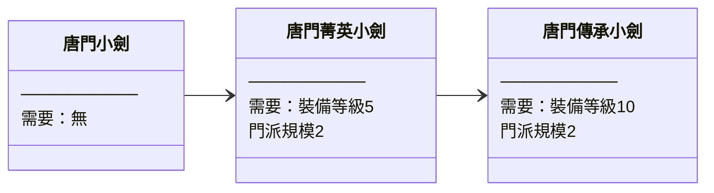

## {{ $frontmatter.title }}

### 鍛造

1. 裝備 - 武器

```mermaid
classDiagram
direction LR

class 唐門小劍{
    ──────────
    需要：無
}

class 唐門菁英小劍{
    ──────────
    需要：裝備等級5
    門派規模2
}

class 唐門傳承小劍{
    ──────────
    需要：裝備等級10
    門派規模2
}

唐門小劍 --> 唐門菁英小劍
唐門菁英小劍 --> 唐門傳承小劍

```

2. 裝備 - 防具
```mermaid

```

3. 暗器 - 平射
```mermaid

```

4. 暗器 - 拋射
```mermaid

```

5. 暗器 - 陷阱
```mermaid

```